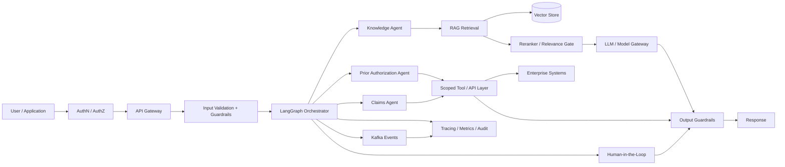

# Pharmacy Agentic AI Platform

> **Independent reference implementation | Healthcare / PBM | Agentic AI | RAG | Kafka | Cloud Architecture | DevSecOps**

[](https://github.com/YOUR-GITHUB-USERNAME/pharmacy-agentic-ai-platform/actions)
[](https://www.python.org/)
[](https://langchain-ai.github.io/langgraph/)
[](https://kafka.apache.org/)
[](https://cloud.google.com/)

## Executive Summary

This repository demonstrates how I approach **enterprise healthcare modernization and Agentic AI architecture** from business problem through implementation, integration, security, operations, and cloud deployment.

The solution models representative Pharmacy Services / PBM workflows such as:

- Prior authorization knowledge and decision support
- Claims investigation and policy lookup
- Formulary and benefit-policy retrieval
- Human-in-the-loop escalation
- Event-driven integration using Kafka
- Retrieval-augmented generation with grounded responses
- Guardrails, observability, evaluation, and DevSecOps

The implementation is intentionally independent and uses **synthetic data only**. It is not a reproduction of any client system or proprietary implementation.

---

## Why this project exists

Enterprise healthcare organizations need to modernize legacy workflows without creating another isolated AI proof of concept.

The architecture therefore treats GenAI as an **enterprise capability**:

1. Secure entry and identity
2. Intent classification and orchestration
3. Domain-specific agents
4. Grounded retrieval
5. Scoped business tools/APIs
6. Event-driven integration
7. Human approval where risk requires it
8. Evaluation and observability
9. Cloud-native deployment and DevSecOps

---

## Reference Architecture



### Architecture principles

- **Domain-first:** business capabilities are modeled as bounded contexts rather than AI features.
- **Orchestration over autonomy:** agents operate within explicit responsibilities and tool boundaries.
- **Ground before generation:** retrieval and policy evidence are preferred over unsupported model reasoning.
- **Event-driven integration:** Kafka decouples long-running workflows and downstream consumers.
- **Human control:** high-impact decisions can pause for approval.
- **Provider abstraction:** model access is separated from business logic to support model routing and future provider changes.
- **Cloud portability:** core application patterns are cloud-neutral, with a GCP deployment foundation included.

---

## Domain-Driven Design

The reference domain is decomposed into bounded contexts:

| Bounded Context | Responsibility |
|---|---|
| Member & Eligibility | Member identity, coverage, eligibility |
| Formulary | Drug coverage and preferred alternatives |
| Prior Authorization | Clinical / policy criteria and workflow |
| Claims | Claim intake, adjudication context, investigation |
| Benefits | Benefit rules and plan configuration |
| AI Decision Support | Retrieval, reasoning, recommendation, escalation |
| Integration | Kafka events and enterprise API boundaries |

The agents sit **above the domain services**; they do not become the system of record.

---

## Agent Architecture

The orchestration layer uses LangGraph to provide explicit state transitions.

### Representative agents

**Supervisor / Orchestrator**
- Classifies the request
- Selects the appropriate capability
- Maintains workflow state
- Applies failure/fallback rules

**Knowledge Agent**
- Retrieves relevant policy content
- Produces grounded answers
- Identifies missing evidence

**Prior Authorization Agent**
- Interprets synthetic PA policy
- Checks required information
- Routes uncertain/high-risk cases to HITL

**Claims Agent**
- Investigates claim-related questions
- Calls scoped claim tools
- Returns evidence and next actions

### Why multi-agent?

The agents have **different tools, data boundaries, policies, and failure modes**. Splitting them makes authorization, testing, evaluation, and operational ownership clearer than giving one general-purpose agent unrestricted access.

---

## RAG Architecture

The repository includes a lightweight retrieval implementation for local demonstration.

Production evolution would use:

```text
Documents
   ↓
Ingestion / Cleaning
   ↓
Semantic Chunking
   ↓
Embeddings
   ↓
Vector Store + Metadata
   ↓
Hybrid Retrieval
   ↓
Reranking
   ↓
Evidence Threshold
   ↓
LLM
   ↓
Citation / Grounded Response
```

### Retrieval design choices

- Chunk by policy section / semantic boundary rather than arbitrary fixed windows.
- Preserve metadata such as policy type, version, effective date, and domain.
- Use hybrid retrieval when terminology and identifiers matter.
- Add a reranking stage for high-value workflows.
- Refuse or escalate when evidence confidence is below the configured threshold.

---

## Kafka / Event-Driven Integration

Representative events include:

```text
prior-authorization.requested
prior-authorization.review-required
claim.investigation-requested
claim.status-updated
ai.decision-support.completed
human-review.completed
```

Kafka provides:

- Loose coupling between bounded contexts
- Replayability
- Consumer independence
- Asynchronous workflow support
- Scalable downstream processing

Production hardening would add schema registry, compatibility rules, idempotency keys, DLQs, retry topics, consumer lag monitoring, and trace propagation.

---

## Security & Responsible AI

Security is designed as a perimeter around the agentic system:

- Authentication and authorization
- Least-privilege tool credentials
- Input validation
- Prompt-injection / jailbreak detection
- Output filtering
- Sensitive-data minimization
- Audit logging
- Human approval for high-impact actions
- Secret management outside source control
- Network isolation and service-to-service controls

**No real PHI, client data, credentials, or proprietary artifacts are included.**

---

## Observability

The design treats AI observability as more than application logs:

- Request / workflow correlation IDs
- Agent transition tracing
- Tool invocation audit
- Latency and token metrics
- Retrieval relevance
- Guardrail outcomes
- Human escalation rate
- Model / prompt version
- Error and fallback paths

Target production integrations include OpenTelemetry-compatible tracing and centralized metrics/logging.

---

## Evaluation

The `evaluation/` area establishes a repeatable framework for measuring:

- Answer correctness
- Groundedness
- Retrieval relevance
- Safety / guardrail behavior
- Tool-call correctness
- Latency
- Cost per workflow

The important architectural principle is **evaluate the workflow, not just the LLM**.

---

## Cloud Architecture

The application is containerized and includes a GCP Terraform foundation.

A production implementation can map the components to managed services such as:

| Capability | GCP pattern |
|---|---|
| API / services | Cloud Run or GKE |
| LLM | Vertex AI |
| Vector retrieval | Vertex AI Vector Search / managed PostgreSQL |
| Events | Pub/Sub or Kafka on GCP |
| Data | Cloud Storage / BigQuery |
| Secrets | Secret Manager |
| Identity | IAM / Workload Identity |
| Observability | Cloud Logging / Monitoring / Trace |
| Security perimeter | VPC Service Controls + IAM |

Equivalent AWS and Azure mappings can be used where the enterprise landing zone dictates.

---

## DevSecOps

The repository includes:

- GitHub Actions CI
- Automated tests
- Container build
- Security scanning
- Infrastructure-as-code foundation
- Environment separation
- Configuration through environment variables
- Runbook and architecture decision records

---

## Buy vs Build

The architecture deliberately separates capabilities that should generally be **managed/commodity** from differentiating business logic.

### Prefer managed

- Foundation models
- Identity
- Secrets
- Cloud networking controls
- Managed vector infrastructure
- Observability platforms
- Kafka platform where enterprise standard exists

### Build where differentiation matters

- PBM workflow orchestration
- Domain policies
- Agent/tool boundaries
- Business rules
- Human approval workflows
- Enterprise integration adapters
- Evaluation criteria

See `docs/buy-vs-build.md`.

---

## Architecture Decision Records

| ADR | Decision |
|---|---|
| ADR-001 | Agent orchestration |
| ADR-002 | Vector-store strategy |
| ADR-003 | Model/provider abstraction |
| ADR-004 | Kafka integration |
| ADR-005 | Cloud deployment strategy |
| ADR-006 | Security architecture |
| ADR-007 | Buy vs. build |

---

## Local Demo

```bash
git clone https://github.com/YOUR-GITHUB-USERNAME/pharmacy-agentic-ai-platform.git
cd pharmacy-agentic-ai-platform

python -m venv .venv
# Windows:
.venv\Scripts\activate

pip install -r requirements.txt
cp .env.example .env

uvicorn app.main:app --reload
```

API health check:

```text
GET /health
```

The Docker Compose configuration provides local infrastructure for demonstration.

---

## Repository Structure

```text
app/
  agents/          # LangGraph orchestration and domain agents
  domain/          # PBM domain model
  guardrails/      # Input/output safety controls
  integration/     # Kafka integration
  llm/             # Model-provider abstraction
  observability/   # Logging/tracing
  rag/             # Retrieval
  tools/            # Scoped business tools

data/               # Synthetic policy data
docs/               # Architecture, ADRs, runbook
evaluation/         # Evaluation framework
terraform/          # GCP infrastructure foundation
tests/              # Automated tests
.github/            # CI/CD
```

---

## What this demonstrates

| Client capability | Portfolio evidence |
|---|---|
| Enterprise solution architecture | End-to-end reference architecture |
| Healthcare / PBM | Pharmacy and PBM bounded contexts |
| Agentic AI | LangGraph supervisor + specialized agents |
| RAG | Retrieval pipeline and grounding strategy |
| Cloud | GCP Terraform + AWS/Azure mapping |
| Kafka | Event-driven integration |
| Security | Guardrails, IAM/tool boundaries, audit |
| DevSecOps | CI, testing, scanning, IaC |
| DDD | Explicit bounded contexts |
| SQL / NoSQL | Data architecture documented for polyglot persistence |
| AI/ML/GenAI | Model abstraction, evaluation, RAG |
| RPA / automation | Workflow automation patterns documented |
| Cost optimization | Managed-service and model-routing principles |
| Architecture leadership | ADRs, buy-vs-build, modernization principles |
| POC delivery | Local runnable reference implementation |

---

## Disclaimer

This is an **independent reference implementation created for portfolio demonstration**. It contains synthetic healthcare/PBM data and does not contain client source code, confidential information, PHI, credentials, or proprietary intellectual property.

Production architecture decisions would be adapted to the enterprise's security, compliance, cloud landing zone, data governance, and operational standards.
