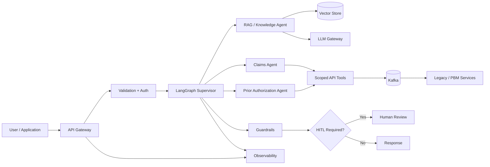

# Pharmacy Agentic AI Platform

> **Independent reference implementation — no client proprietary code, data, credentials, or intellectual property.**

A cloud-native reference architecture for Pharmacy Services / PBM workflows demonstrating **Agentic AI, RAG, healthcare integration, Kafka, Domain-Driven Design, DevSecOps, observability, HITL, and cloud architecture**.

This project is intentionally built as a portfolio/reference implementation to demonstrate hands-on architecture and engineering capability for enterprise healthcare modernization.

## What this demonstrates

- **Agentic AI:** LangGraph supervisor + specialist agents
- **RAG:** chunking, embeddings, vector retrieval, metadata filtering
- **LLM strategy:** provider abstraction with Vertex AI / OpenAI-compatible endpoints and deterministic demo mode
- **Healthcare:** synthetic PBM data, FHIR-inspired concepts, PHI-safe design patterns
- **Integration:** REST APIs + Apache Kafka event-driven architecture
- **Cloud:** GCP-oriented deployment model; portable containers
- **Security:** OAuth/JWT boundary, least-privilege tool access, prompt-injection defense, output validation
- **Architecture:** Domain-Driven Design, bounded contexts, reference architecture, buy-vs-build analysis
- **DevSecOps:** Docker, GitHub Actions, Terraform foundation
- **Operations:** structured logging, trace/correlation IDs, health checks
- **HITL:** confidence-based escalation for high-impact workflows
- **Cost optimization:** model routing, caching hooks, token/cost telemetry
- **POC evaluation:** quality, groundedness, latency, cost, and safety dimensions

## Architecture



## Domain-Driven Design

### Bounded contexts

1. **Member Services** — eligibility and member context
2. **Claims** — claim status and adjudication inquiries
3. **Prior Authorization** — PA requirements and status
4. **Formulary / Knowledge** — medication and policy knowledge
5. **Integration** — Kafka/API/legacy connectivity
6. **AI Orchestration** — agent state, routing, tools, guardrails

The project keeps domain logic behind interfaces so that cloud/platform changes do not force changes to core business behavior.

## Repository structure

```text
pharmacy-agentic-ai-platform/
├── app/
│   ├── api/                 # FastAPI endpoints
│   ├── agents/              # LangGraph supervisor + specialist agents
│   ├── domain/              # DDD entities/value objects
│   ├── rag/                 # ingestion, chunking, retrieval
│   ├── tools/               # scoped business/API tools
│   ├── guardrails/          # input/output safety controls
│   ├── llm/                 # model/provider abstraction
│   └── observability/       # logging/correlation
├── data/
│   ├── formulary/
│   ├── claims/
│   └── prior_auth/
├── tests/
├── evaluation/
├── terraform/gcp/
├── docker/
├── .github/workflows/
├── docs/
└── docker-compose.yml
```

## Quick start

### 1. Clone and configure

```bash
cp .env.example .env
```

For a no-credential demo, leave `LLM_PROVIDER=demo`.

### 2. Start local infrastructure

```bash
docker compose up -d
```

This starts PostgreSQL/pgvector and Kafka.

### 3. Install Python dependencies

```bash
python -m venv .venv
source .venv/bin/activate
pip install -r requirements.txt
```

### 4. Run the API

```bash
uvicorn app.main:app --reload --port 8080
```

Open:

```text
http://localhost:8080/docs
```

### 5. Try the assistant

```bash
curl -X POST http://localhost:8080/v1/assist \
  -H "Content-Type: application/json" \
  -d '{"message":"What documentation is generally required for a prior authorization?","member_id":"M1001"}'
```

The demo provider returns deterministic responses without requiring an external LLM key.

## Example workflows

### Prior Authorization

```text
User
 → Intent classification
 → Prior Authorization Agent
 → Knowledge/RAG lookup
 → Policy grounding
 → Confidence check
 → HITL if needed
 → Response
```

### Claims inquiry

```text
User
 → Supervisor
 → Claims Agent
 → Scoped Claims Tool
 → Kafka event
 → Claim service
 → Result
 → Guardrail
 → Response
```

## RAG strategy

The reference implementation uses:

- semantic chunking with configurable chunk size
- overlap to preserve context
- metadata: document type, effective date, source
- retrieval top-k
- optional confidence threshold
- citation-ready source metadata

For production, the vector layer can be replaced by **Vertex AI Vector Search, AlloyDB/pgvector, OpenSearch, or another enterprise-approved vector platform**.

## Agent design

### Supervisor

Routes requests to the smallest capable agent and maintains workflow state.

### Knowledge Agent

Answers policy/formulary questions using grounded retrieval.

### Claims Agent

Uses a narrowly scoped claims tool rather than giving the LLM unrestricted database access.

### Prior Authorization Agent

Combines policy retrieval with workflow/tool access and can request human review for low-confidence or high-impact outcomes.

## Security and guardrails

The project demonstrates architecture patterns rather than claiming regulatory certification.

Controls include:

- authentication boundary
- least-privilege tool interfaces
- input validation
- prompt-injection pattern detection
- output validation
- no unrestricted SQL generated by the model
- synthetic data only
- correlation IDs
- audit-friendly event structure
- HITL for sensitive decisions

For a real HIPAA workload, additional enterprise controls, BAA/vendor review, encryption, retention, access governance, audit controls, and formal security/compliance validation would be required.

## Kafka design

Topics:

```text
pharmacy.claims.inquiry
pharmacy.prior-auth.requested
pharmacy.agent.audit
```

Patterns demonstrated:

- consumer groups
- event keys
- retries
- dead-letter topic concept
- idempotency key
- correlation ID
- schema version

## Buy vs Build

| Capability | Build | Buy / Managed | Reference recommendation |
|---|---|---|---|
| Foundation LLM | No | Yes | Managed model |
| Vector search | Optional | Yes | Managed/enterprise vector service |
| Agent orchestration | Yes | Optional | Build domain orchestration |
| API gateway | No | Yes | Managed gateway |
| Kafka | No | Yes | Managed Kafka where available |
| Observability | No | Yes | Enterprise platform |
| Business workflow | Yes | Depends | Build domain-specific logic |

## Cost optimization

Architecture levers:

1. route simple questions to smaller models
2. use RAG before expensive long-context generation
3. cache stable knowledge responses where policy permits
4. enforce token budgets
5. batch embedding operations
6. monitor cost per workflow
7. use asynchronous Kafka processing for non-interactive workloads

## POC evaluation

The `evaluation/` package defines a lightweight scorecard:

- answer quality
- groundedness
- retrieval relevance
- latency
- token usage
- estimated cost
- safety failures

The objective is to make model/vendor decisions based on measurable business and technical criteria rather than model popularity.

## Cloud reference architecture

The preferred target is GCP:

```text
Client
  |
Cloud Load Balancing / API Gateway
  |
Cloud Run or GKE
  |
LangGraph Application
  |--------- Vertex AI / Model Gateway
  |--------- AlloyDB / pgvector or Vector Search
  |--------- Managed Kafka
  |--------- Cloud Logging / Monitoring / Trace
  |
Private VPC + IAM + Secret Manager
```

Terraform in `terraform/gcp/` is intentionally a **foundation template**. Production deployment requires organization-specific project IDs, IAM policies, networking ranges, approved modules, and security controls.

## JD alignment

| Client requirement | Portfolio evidence |
|---|---|
| 10–15+ years architecture/development | Resume/experience; GitHub demonstrates hands-on depth |
| Enterprise Solution Architecture | `docs/reference-architecture.md` |
| Cloud implementation | GCP Terraform + Docker |
| AI experience | Agentic AI + RAG + model abstraction |
| Healthcare domain | PBM workflows + synthetic healthcare data |
| Agentic AI | LangGraph supervisor/specialist agents |
| Application/integration architecture | FastAPI + Kafka + tool interfaces |
| Security | Auth boundary + guardrails + least privilege |
| Automation | CI/CD + Terraform + Docker |
| DDD | Bounded contexts + domain layer |
| Kafka / legacy glue | Event-driven integration |
| DevSecOps | GitHub Actions + security checks |
| DataOps | Data ingestion/evaluation patterns |
| SQL / NoSQL | PostgreSQL + document-oriented sample patterns |
| Prototypes / POCs | Runnable local demo |
| AI/ML + RPA | AI workflow plus automation-ready tool boundary |
| Cloud-native | Containers + GCP target architecture |
| Cradle-to-grave leadership | Reference architecture + operational considerations |
| Buy vs Build | Decision matrix |
| Architecture reviews | ADRs and design review checklist |
| Reference architecture | Mermaid diagrams + architecture document |
| Technical roadblocks | Troubleshooting/runbook documentation |
| Cost optimization | Model routing/cache/token strategy |
| Mentoring/upskilling | Architecture decision records and implementation guide |

## Disclaimer

This repository is an independent portfolio/reference implementation. It does **not** represent a production implementation for CVS, Walmart, Kroger, Accenture, or any other client/employer. All healthcare data is synthetic.
