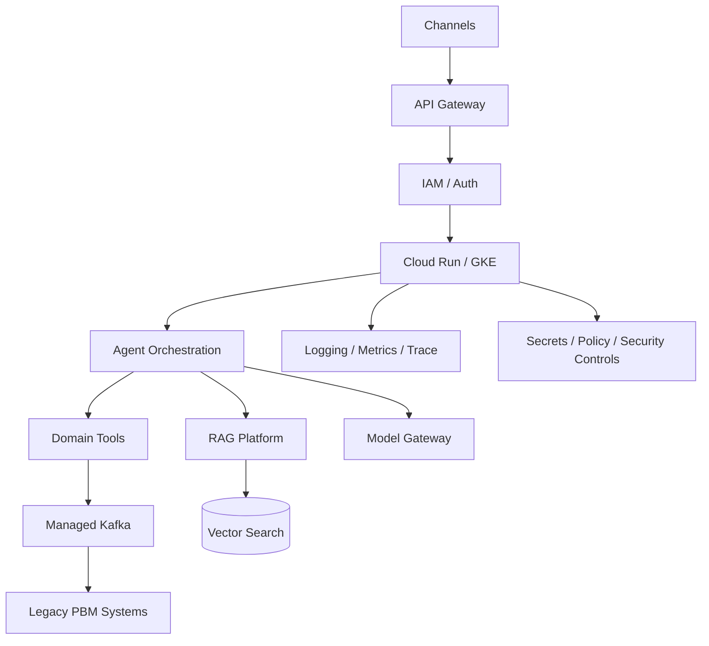

# Cloud-Native PBM Reference Architecture

## Principles

- API-first
- domain-aligned services
- event-driven integration where asynchronous processing is appropriate
- zero-trust security boundary
- least privilege
- managed cloud services by default
- observable by design
- human oversight for high-impact AI decisions
- portable application containers

## Logical architecture

## Architecture review checklist

- Business capability and bounded context identified
- synchronous vs asynchronous interactions justified
- data ownership identified
- failure modes and retry strategy defined
- idempotency addressed
- security boundary documented
- observability requirements defined
- RTO/RPO considered
- cost drivers identified
- buy-vs-build decision recorded
- migration and rollback plan defined
